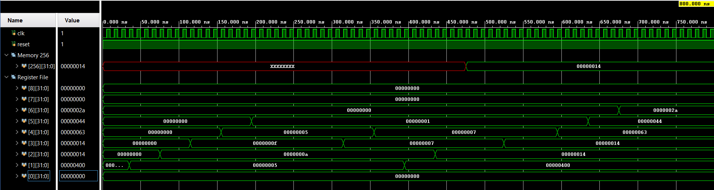

# Multi-Cycle-Processor
This is a reduced implementation of a multi-cycle version of a RISC-V RV32I processor using Verilog.  
The following type of instructions have been implemented - R-type, I-type, B-type, J-type, S-type.

A list of all the instructions implemented is as follows:  
R-Type: ADD,SUB,SLT,OR,AND  
I-Type: ADDI, SLT, ORI, ANDI  
LW(load word) - This is also an I-type instruction.  
S-Type: SW  
B-Type: BEQ, BNE  
J-Type: JAL  

To test the design, we take a test program which includes all the implemented instructions and convert it into its equivalent hex code and place it in the instruction memory.  
Since there is only one memory, the instruction and data memory need to be separated via software. The instruction memory starts at 0x000 and the data memory starts at 0x400
Here is the assembly program:
# Initialize registers
addi x1, x0, 5       # x1 = 5
addi x2, x0, 10      # x2 = 10

# Arithmetic
add x3, x1, x2         # x3 = x1 + x2 = 15  
sub x4, x2, x1         # x4 = x2 - x1 = 5  
slt x5, x1, x2         # x5 = (x1 < x2) ? 1 : 0 = 1  
slti x6, x2, 5         # x6 = (x2 < 5) ? 1 : 0 = 0  
and x7, x1, x2         # x7 = x1 & x2 = 0  

# Logic with immediate  
andi x3, x3, 7         # x3 = x3 & 7 = 15 & 7 = 7  
ori x4, x4, 2          # x4 = x4 | 2 = 5 | 2 = 7  

# Memory operations  
addi x1, x0, 0x400    # x1 = base address for data  
addi x2, x0, 20       # x2 = value to store  
sw x2, 0(x1)          # Mem[0x400] = 20  
lw x3, 0(x1)          # x3 = Mem[0x400] = 20  

# Branch  
beq x2, x3, skip       # if x2 == x3 jump
addi x4, x0, 0         # should be skipped
skip:  
addi x4, x0, 99        # x4 = 99

# Jump and link  
jal x5, next           # x5 = PC+4, jump to next
addi x0, x0, 0         # will be skipped
next:  
addi x6, x0, 42        # x6 = 42

Upon successful operation of the above program, the following values are expected in the given registers:   
x1 -> 0x1000
x2 -> 0x14
x3 -> 0x14
x4 -> 0x63
x5 -> 0x44
x6 -> 0x2A
The following value is expected in memory:
Mem[0x400] = 20

Here are the waveforms: 

